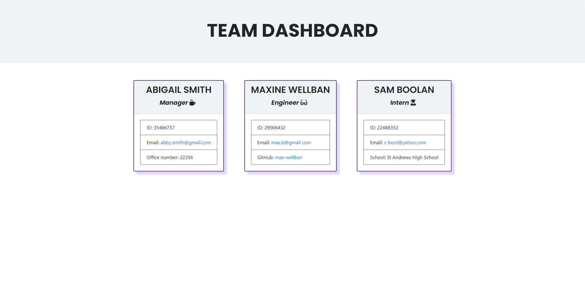

# Team Profile Generator

Welcome to The Team Profile Generator App.

Following on from our lesson on Object Oriented Programming, I have created a Team Profile generator using npm Inquirer and Node.js.

## About The Project

The task for this challenge was to build an application that allows a team manager to generate a html page that displays their team's employee details. The employee details are created by answering questions prompted by Inquirer using the command line. Once the file is generated it is then saved to a folder called "output".

### Technologies
This project is created with:

- Visual Studio Code 1.83.1
- Git Bash 5.2.15
- Node.js
- npm Inquirer
- Bootstrap 4

### Key Features
- Displays prompts in the terminal using Node.js
- Answers are saved to a new HTML file
- Team member information is displayed in Boostrap card format, styled with custom CSS

### How to Use This Application

### Credits 
-[Stack Overflow](stackoverflow.com)
- Google Searches

### License 
None
